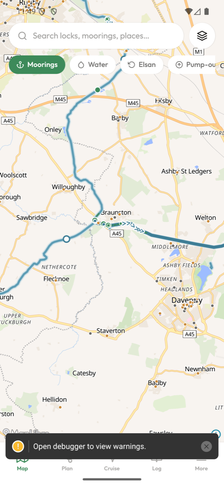
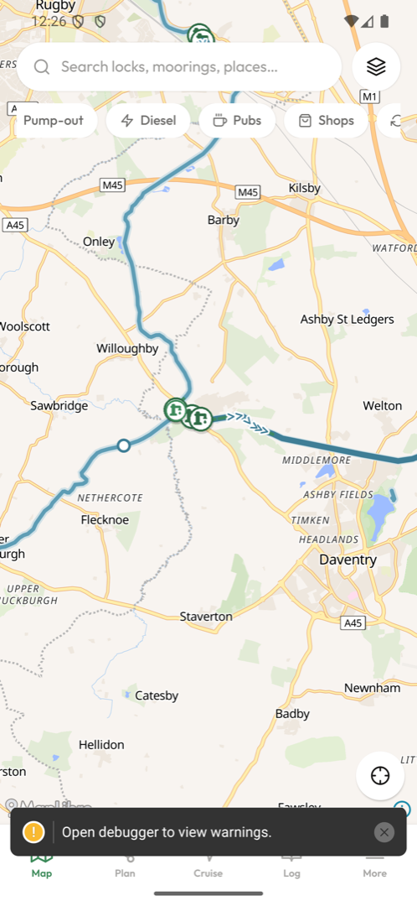
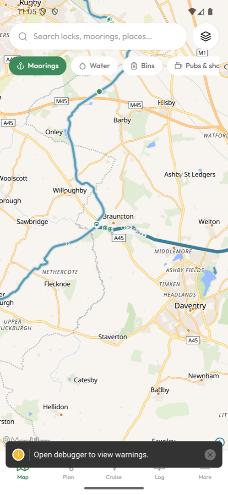

# Moorhen 🐦

**The open-source canal companion for the UK waterways** — built for people who live on the cut.

[](https://github.com/lovelaced/moorhen/actions/workflows/ci.yml)
[](https://github.com/lovelaced/moorhen/actions/workflows/nightly-etl.yml)
[](LICENSE)

Every existing canal tool covers static geography. The questions boaters actually have are _temporal_: **Is that water point working today? Is there a stoppage ahead — in my direction? Can my boat actually get into the bank here, and is there a pub, a shop, and 4G?** Moorhen answers those, offline-first, free forever, ad-free forever.

|                                                    |                                               |                                          |
| -------------------------------------------------- | --------------------------------------------- | ---------------------------------------- |
|  |  |     |
| _Lock chevrons point uphill; winding holes ringed_ | _Water, diesel, pubs — 20 min walk max_       | _Wide vs narrow canals drawn distinctly_ |

## What works today

- 🗺️ **The whole navigable network** — 10,383 km from OpenStreetMap, wide and narrow canals drawn distinctly, derelict canals dashed, rivers classified; routable graph with 1,966 gauge-classified locks
- 🔒 **Locks like a paper map** — one chevron per chamber, pointing uphill, tappable (name, gauge, waterway)
- 🍺 **Services within a 20-minute walk of the cut** — pubs, shops, laundries, boat fuel, chandleries, Elsan, pump-outs, bins, railway stations; every marker tappable with distance-from-towpath and a Street View jump
- ⚠️ **Live stoppages** — a Cloudflare Worker polls CRT notices every 15 min, publishes to the CDN, and pushes FCM alerts per waterway (only Published navigation-blocking notices — no noise)
- 🧭 **Journey timing that respects reality** — lock-miles model with per-section speed factors, direction-dependent current (the Llangollen problem), narrow/broad lock rates, tunable pace
- 📱 **The app** — Expo/React Native + MapLibre, warm modern design, rotation with re-north compass, locate-me, functional layer chips
- 🔄 **Self-refreshing data platform** — nightly GitHub Actions rebuild from OSM + CRT + FSA, drift-checked, published to Cloudflare R2 (free tier, £0/month infrastructure)

## Roadmap (see `docs/`)

Cruise mode with **directional stoppage alerts** ("closed 4.8 mi ahead — last good mooring before it: …") · **moored-up detection** → one-tap speed test + photo → private mooring/coverage map with photo pins · community facility status ("confirmed working 2 h ago by 3 boaters") · structured mooring reviews (rings/armco/pins, depth, noise) · CC movement log with CRT evidence export · offline PMTiles regions · winter-works date-clash warnings on routes.

## Development

```sh
pnpm install
pnpm test                 # 82 tests: golden-tested against real OSM extracts & live-captured API fixtures
pnpm typecheck && pnpm typecheck:mobile
pnpm registry:check       # licence gate — every data source must be registered & allowed

# data build (needs osmium; tippecanoe optional for tiles)
pnpm etl:build --pbf great-britain-latest.osm.pbf --out artifacts --tiles

# app (dev build required for the native map — Expo Go shows a placeholder)
cd apps/mobile && npx expo run:android
```

| Path               | What                                                                 |
| ------------------ | -------------------------------------------------------------------- |
| `apps/mobile/`     | Expo app                                                             |
| `packages/graph/`  | Waterway graph, routing, chainage, timing, direction detection       |
| `packages/etl/`    | Data pipelines (OSM, CRT, FSA) → versioned artifacts                 |
| `packages/schema/` | Zod contracts for everything published                               |
| `workers/notices/` | CRT notice poller + FCM push (Cloudflare Worker)                     |
| `data/registry/`   | Machine-readable licence registry — CI fails on unregistered sources |
| `docs/`            | Product notes, data sources, licensing, tiles, credentials           |

## Data & licensing

Three separately-provenanced stores, never merged (see `docs/licensing.md`): OpenStreetMap (ODbL), official sources (CRT/EA/FSA/OS, per-dataset licences), and the community layer (ODbL, upstreamable to OSM). The CRT centreline is deliberately **not** used (licence ambiguity); OSM geometry is complete and clean. **No ads or paid tiers, ever** — partly conviction, partly licence-compelled (CRT + Open-Meteo non-commercial terms). We never scrape [redacted] (`docs/[redacted].md`).

Map data © OpenStreetMap contributors · Boater facility data © The Canal & River Trust copyright and database rights reserved · Hygiene ratings: Food Standards Agency (OGL) · River data: Environment Agency (OGL).

## Disclaimers

Moorhen is an independent open-source project, **not affiliated with the Canal & River Trust**. Data can be wrong or stale — always follow signage and official notices on the water, and never rely on any app as your sole aid to navigation.

## Licence

Code GPL-3.0-only. Community data ODbL. Contributions welcome — the licence registry and tests will keep us all honest.
