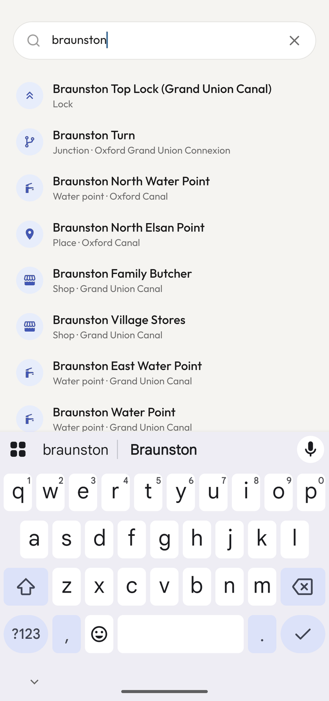

<div align="center">
  
</div>

# Moorhen

**The open-source canal companion for the UK waterways** — offline-first maps, live stoppages, moorings and services, built for boaters who live on the cut.

[](https://github.com/lovelaced/moorhen/actions/workflows/ci.yml)
[](https://github.com/lovelaced/moorhen/actions/workflows/nightly-etl.yml)
[](https://github.com/lovelaced/moorhen/actions/workflows/android.yml)
[](LICENSE)

|                                                                                  |                                                                                                |                                                                                                    |
| -------------------------------------------------------------------------------- | ---------------------------------------------------------------------------------------------- | -------------------------------------------------------------------------------------------------- |
|  |  |  |
| _The network at a glance — moorings, water, winding holes_                       | _Chevrons point uphill; tap a lock for gauge and waterway_                                     | _Search the whole cut: locks, water points, village shops_                                         |

Every existing canal tool covers static geography. The questions boaters actually have are _temporal_: **Is that water point working today? Is there a stoppage ahead — in my direction? Can my boat actually get into the bank here, and is there a pub, a shop, and 4G?** Moorhen answers those. Free forever, ad-free forever.

## Features

- 🗺️ **The whole navigable network** — 10,383 km from OpenStreetMap: wide and narrow canals drawn distinctly, derelict canals dashed, rivers classified, and a routable graph with 1,966 gauge-classified locks
- 🔒 **Locks like a paper map** — one chevron per chamber, pointing uphill; tap any for name, gauge and waterway
- 🍺 **Services within a walk of the cut** — pubs, shops, laundries, boat fuel, chandleries, Elsan, pump-outs, bins and railway stations, each with its distance from the towpath and a Street View jump
- ⚠️ **Live stoppages** — CRT notices polled every 15 minutes and pushed per waterway, filtered to published navigation blockers only — no noise
- 🧭 **Journey timing that respects reality** — a lock-miles model with per-section speed factors, direction-dependent current (the Llangollen problem), narrow/broad lock rates and tunable pace
- 📱 **Offline-first** — downloadable regional basemaps, because canals go where signal doesn't
- 🔄 **Data that refreshes itself** — a nightly pipeline rebuilds everything from OSM, CRT and FSA, drift-checks it, and publishes to a CDN for £0/month of infrastructure

## Get the app

Moorhen isn't in the app stores yet, but every change to the app builds an installable Android APK:

1. Open [Actions → Android APK](https://github.com/lovelaced/moorhen/actions/workflows/android.yml)
2. Pick the latest green run and download the **moorhen-apk** artifact
3. Install it on your phone (`adb install app-release.apk`, or just open the file)

iOS runs from source for now: `cd apps/mobile && npx expo run:ios`.

## Development

```sh
pnpm install
pnpm test                 # 114 tests: golden-tested against real OSM extracts & live-captured API fixtures
pnpm typecheck && pnpm typecheck:mobile
pnpm registry:check       # licence gate — every data source must be registered & allowed

# data build (needs osmium; tippecanoe optional for tiles)
pnpm etl:build --pbf great-britain-latest.osm.pbf --out artifacts --tiles

# app (dev build required for the native map — Expo Go shows a placeholder)
cd apps/mobile && npx expo run:android
```

| Path               | What                                                                 |
| ------------------ | -------------------------------------------------------------------- |
| `apps/mobile/`     | Expo app                                                             |
| `packages/graph/`  | Waterway graph, routing, chainage, timing, direction detection       |
| `packages/etl/`    | Data pipelines (OSM, CRT, FSA) → versioned artifacts                 |
| `packages/schema/` | Zod contracts for everything published                               |
| `workers/notices/` | CRT notice poller + FCM push (Cloudflare Worker)                     |
| `data/registry/`   | Machine-readable licence registry — CI fails on unregistered sources |
| `docs/`            | Product notes, data sources, licensing, tiles, credentials           |

## How the data works

Every night, GitHub Actions downloads the Geofabrik GB extract, filters it with osmium, builds the waterway graph and every map layer, fetches CRT facilities and stoppage notices, drift-checks the result against the last manifest, and syncs the artifacts to Cloudflare R2. The app consumes only these static files — there is no server in the hot path, which is how the whole platform runs on free tiers.

## Roadmap

See `docs/` for the full product notes. Coming: cruise mode with **directional stoppage alerts** ("closed 4.8 mi ahead — last good mooring before it: …") · moored-up detection → one-tap speed test + photo → private mooring/coverage map · community facility status ("confirmed working 2 h ago by 3 boaters") · structured mooring reviews (rings/armco/pins, depth, noise) · CC movement log with CRT evidence export · winter-works date-clash warnings on routes.

## Data & licensing

Three separately-provenanced stores, never merged (see `docs/licensing.md`): OpenStreetMap (ODbL), official sources (CRT/EA/FSA/OS, per-dataset licences), and the community layer (ODbL, upstreamable to OSM). The CRT centreline is deliberately **not** used (licence ambiguity); OSM geometry is complete and clean. **No ads or paid tiers, ever** — partly conviction, partly licence-compelled (CRT + Open-Meteo non-commercial terms).

Map data © OpenStreetMap contributors · Boater facility data © The Canal & River Trust copyright and database rights reserved · Hygiene ratings: Food Standards Agency (OGL) · River data: Environment Agency (OGL).

## Disclaimers

Moorhen is an independent open-source project, **not affiliated with the Canal & River Trust**. Data can be wrong or stale — always follow signage and official notices on the water, and never rely on any app as your sole aid to navigation.

## Licence

Code GPL-3.0-only. Community data ODbL. Contributions welcome — the licence registry and tests will keep us all honest.

_And somewhere in the app, seven taps wake something old._
